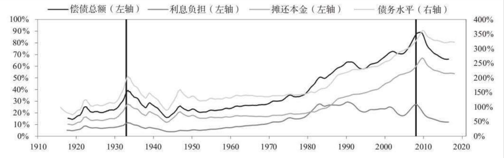
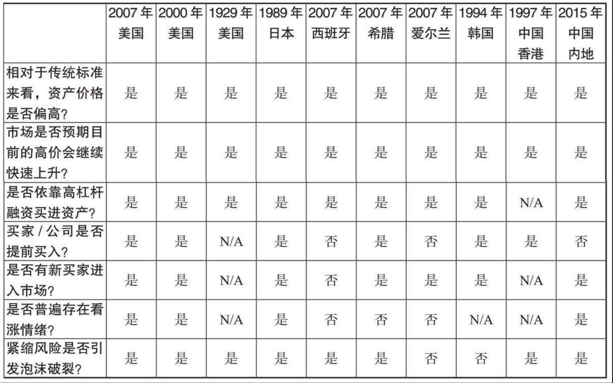

<!-- more -->
信贷是指赋予他人购买力，他人承诺今后偿还该购买力，即偿还债务。

判断信贷/债务快速增长是好事还是坏事，取决于信贷产生的结果和债务偿还情况。

相比信贷/债务增长过快，其增长过慢导致的经济问题同样严重，甚至会更糟糕，因为信贷/债务增长过慢的代价就是会错失发展机会。

由于信贷同时创造了购买力和债务，因此增加信贷是好是坏，取决于能否把借款用于生产性目的，从而创造出足够多的收入来还本付息。

贷款标准过严，债务人几乎铁定能偿还债务，很少会产生债务问题，但缺点是经济发展不足。贷款标准宽松，可能会促进经济发展，但之后可能带来严重的债务问题，使已经取得的经济成果化为乌有。

大量举债的风险主要在于决策者是否有意愿和能力将坏账损失分摊到多年。在我经历和研究的所有案例中，我都看到了这种情况。决策者能不能做到这一点，取决于两个因素：（1）债务是否以决策者能够控制的货币计价；（2）决策者能否对债权人和债务人施加影响。

在任何时候，你一旦借钱，就会创造出一个周期。

一些经济体的增长严重依赖借债进行固定资产投资、房地产和基础设施建设，这些经济体尤其会受到大规模周期性波动的影响，因为那些长期资产的快速建设是不可持续的。

债务融资的房地产、固定投资和基础设施建设拉动经济强劲增长，之后需求增速放缓，债务挑战出现，从而导致经济下行。这类周期常常出现在新兴经济体，因为新兴经济体存在大量的建设需求。

在泡沫阶段，不计后果的贷款和不切实际的预期带来大量无法偿还的债务。在某个时间点，这种状况会被商业银行和中央银行察觉，泡沫开始收缩。泡沫形成的一个典型表现是：越来越多的借款被用来还债，导致借款人债务负担加剧。

一旦资金和信贷增长被遏制，或者贷款标准提高，那么信贷和支出增速就会放缓，偿债问题就会加速涌现，这时就接近于债务周期的顶部。同时，央行意识到信贷增长过快，已经到了危险的地步，于是开始收紧货币政策，遏制信贷增长，进而导致债务周期加速下滑（即使央行不采取措施，债务周期也会下滑，只是下滑的时间会推迟一些而已）。

当偿债成本（即还本付息的成本）超过维持支出的借款时，债务上升周期就会逆转。不仅新增贷款的增速放缓，借款人的还款压力也会增加，还本付息明显难以为继，新增贷款进一步减少。支出和投资增速的放缓导致收入增长进一步放缓，资产价格下跌。

本书研究的均为在过去100年间发生的极端案例，也就是造成实际GDP降幅超过3%的债务危机。通过研究这些危机本身和决策者可使用的政策工具，我发现在几乎所有的债务危机中，只要债务是以一国的本币计价，则决策者都有可能妥善处理。

在大多数情况下，债务危机之所以导致了严重的经济问题，都是因为决策者未能及时采取措施将影响分散化。

债务危机最大的风险不是来自债务本身，而是来自以下因素：（1）决策者缺乏知识，或缺乏权威，难以做出正确的决策；（2）整顿债务问题带来了一些政治后果，在惠及一些人的同时，损害了另一些人的利益。

决策者可以采取以下4种政策措施，以降低债务与收入之间的比率和偿债总额与用于偿债的现金流之间的比率：

（1）财政紧缩（即减少支出）；

（2）债务违约/重组；

（3）央行印钞，购买资产（或提供担保）；

（4）将资金和信贷从充足的领域转向不足的领域。

这些措施会带来不同的受益方和受损方，每项措施对经济的影响延续的时间也不同。决策者因此在政治上置身于困难的境地，要做出艰难的抉择，这令他们即使可以很好地应对债务危机，也很少受到赞赏。

通常情况下，一个国家之所以会爆发债务危机，是因为债务和偿债成本的增速高于偿债所需收入的增速，最后不得不去杠杆化。

债务危机可以大体分为两类，即通缩性债务危机和通胀性债务危机。

从信贷产生的那天起，就有了债务周期。信贷的产生可以追溯到罗马时代之前。《旧约全书》中描述了每50年就要消除一次债务的必要性，即所谓的“禧年”。像大多数戏剧一样，债务周期这部剧幕起幕落，在历史上不断重演。

在通缩性萧条中，决策者会通过降息应对最初的经济萎缩。但当利率接近0%时，这一政策工具就无法有效地刺激经济。此时，债务重组和财政紧缩政策占主导地位，但没有适度的刺激措施（尤其是印钞和货币贬值）产生平衡效果。在这个阶段，收入下降速度快于债务重组速度，偿债会减少债务存量，但为了支付更高的利息成本，许多借款人不得不承担更多债务，因此债务负担（债务和偿债总额占收入的比例）上升。如上所述，通缩性萧条往往出现在大多数债务是国内融资的、以本币计价的国家，因此最终的债务危机会带来强制抛售和违约，但不会造成汇率问题或国际收支问题。

通胀性萧条经常出现在依赖外资流动的国家。这些国家已经积累了大量以外币计价的债务，无法对债务进行货币化（即央行印钞购债）。当外资流动放缓时，信用创造就会变成信贷紧缩。在通胀性去杠杆化进程中，资本外流导致贷款水平和流动性急剧下降，同时汇率下跌拉高通胀率。由于决策者分散不良影响的能力非常有限，大量债务以外币计价的通胀性萧条特别难以管理。

在股市合理上扬期间，人们往往会过分预期这一走势的持续时间，从而导致泡沫出现。

投机者抵押资产的净值上涨，又可以获得新的贷款，进一步助长泡沫膨胀。这时，大多数人认为这不是问题。相反，他们认为这恰好反映和证实了经济繁荣的景象。债务周期的这个阶段通常会自我强化。

以股票为例，股价上涨会增加企业的支出和投资，从而提高企业利润，进一步拉高股价，降低信贷息差，鼓励企业增加借款（因为抵押品的价值增加，企业盈利增长），进而影响企业的支出和投资等。在这种情况下，大多数人认为资产是宝贵的财富，认为没有资产的人都错失了良机。

在许多情况下，货币政策并没有限制泡沫，反而起到了推波助澜的作用 ，尤其是在通胀率和经济增长率良好，投资回报率较高的时候。市场往往认为在这一时期生产率繁荣增长，投资者的乐观情绪不断加强，纷纷举债购买投资性资产。

这是大多数央行政策面临的一大问题。央行政策以控制通胀率和经济增长率为目标，并不针对泡沫管理，但在通胀率和经济增长率似乎并不过高的情况下，央行政策带来的债务增长为泡沫的产生提供了资金。

典型的货币政策并不足以管理泡沫，因为泡沫仅出现在一些特定的经济部门，而央行关注的是整体经济情况，在泡沫阶段央行的政策反应往往会滞后。

泡沫最明确的特征可以总结如下:

（1）相对于传统标准来看，资产价格偏高。

（2）市场预期目前的高价会继续快速上升。

（3）普遍存在看涨情绪。

（4）利用高杠杆融资买进资产。

（5）买家提前很长时间买入（例如增加库存、签订供应合同等），旨在投机或应对未来价格上涨的影响。

（6）新买家（之前未参与市场者）进入市场。

（7）刺激性货币政策进一步助长泡沫（而紧缩性货币政策会导致泡沫破裂）。

